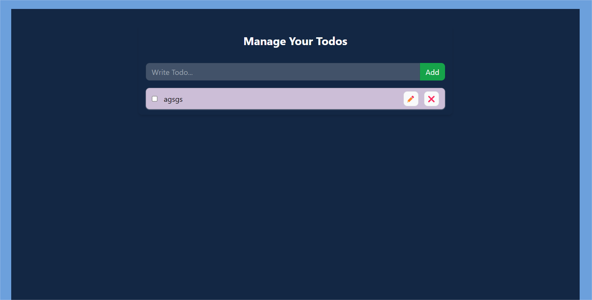

# ToDo App

## Description
The ToDo App is a task management application built using React, Tailwind CSS, and Context API. It allows users to add, edit, mark as complete, and delete tasks efficiently. This project demonstrates how to manage global state using Context API while maintaining a clean and responsive UI with Tailwind CSS.

## Features

* Add new tasks to the to-do list.
* Mark tasks as complete or incomplete.
* Edit tasks with ease.
* Delete tasks when no longer needed.
* Responsive design built with Tailwind CSS for various device sizes.
* Global state management using React's Context API for smooth interaction across components.

## Technologies Used
* React: For building the component-based user interface.
* Tailwind CSS: For styling and ensuring a responsive design.
* Context API: For managing global state (tasks) across the application.

## Installation

1. Clone the repository:

        
        git clone https://github.com/Abhay5981/react-by-ak/tree/main/09todoContextLocal

2. Navigate to the project directory:

        cd todo-app

3. Install the dependencies:

        npm install

4. Start the development server:

        npm start

5. Open the application in your browser at http://localhost:3000.    

## Usage

1. Add a new task using the input field and clicking the 'Add Task' button.
2. View all tasks in the list. Completed tasks are visually distinguished.
3. Click on a task to mark it as complete or incomplete.
4. Edit or delete tasks using the respective buttons next to each task.

## Screenshots

## Contributing

If you'd like to contribute to this project:

1. Fork the repository.
2. Create a new branch (git checkout -b feature/your-feature).
3. Commit your changes (git commit -m 'Add new feature').
4. Push to the branch (git push origin feature/your-feature).
5. Open a Pull Request.
